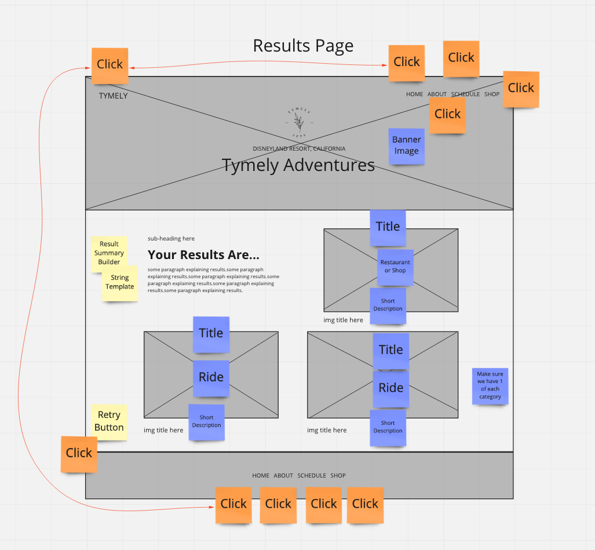
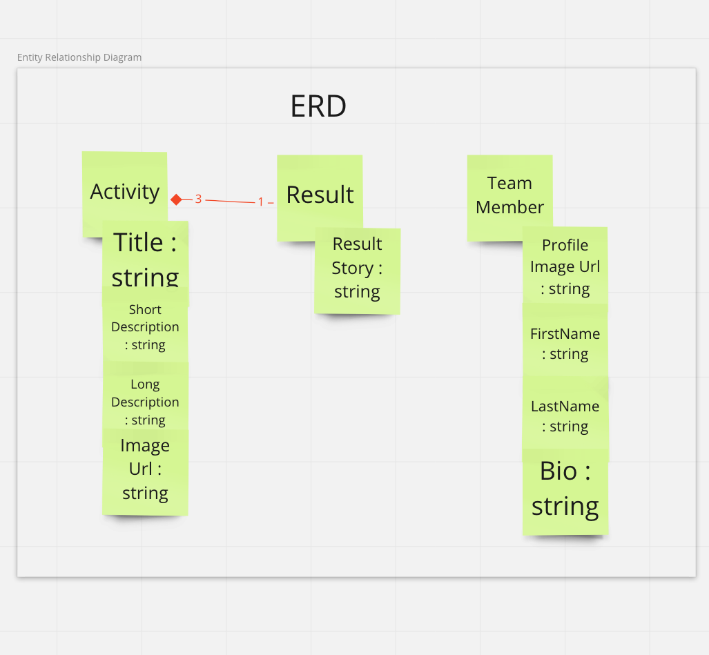

# Wireframe documentation

# Entity Relationship Diagram - ERD

# Requirements

## Vision

**What is the vision of this product?**

This product will help the user plan a day at Disneyland based on the selections they make. 

**What pain point does this project solve?**

This product lays out a clear plan for someone who is overwhelmed or unsure of how to plan their day. 

**Why should we care about your product?**

This product uses a format that could be transferrable to many different platforms and has a lot of room for expansion. 

## Scope (In/Out)

**IN - What will your product do**

**Describe the individual features that your product will do.**

- User can choose between 3 thrill levels from a drop-down menu.
- Save user selection to persistence
- Based on user selection, show appropriate rides or restaurants/shops.
- User can choose between 3 Activity Levels from a drop down menu.
- Save user selection to persistence
- Based on user selection, show appropriate rides or restaurants/shops
- Render 3 Results to the page.
- Show the title and description to each image.
- Show results summary. Acceptance Tests
- Results should show one restaurant or shop relevant to users input selection.
- Results should show two rides relevant to users input selection.
- Each Result should have a title and short description of activity.
- Should show Results description of Adventure Journey on results page.
- User can view a photo each Creator
- Show a name and short bio of each creator.
- Show 2 unique rides
- Give user option to refresh page with new results

**High overview of each. Only need to list 4-5
Example:**
- The web app will provide a plan for the user based on their selections for thrill level and activity level. 
- The web app will render 3 results based on user input. 
- Users will be able to render a new suggestion if they don't like the initial result.
- The user can access a bio page displaying the web page creators.
- 
**OUT - What will your product not do.**
- This web page will not have log-in capabilities. 
- This web page will not have data persistence beyond local storage.
- This web page will not select from all of the attractions at Disneyland, rather utilize a condensed list.

**Minimum Viable Product vs**

**What will your MVP functionality be?**

**Minimum Viable Product (MVP) definition.**

- The form contains 2 input criteria to render results.
- Submit button will send the user to the customized results page. 
- The result page will contain 2 ride suggestions and 1 restaurant or store based on users' selections.
- A button that allows users to regenerate results. 

**What are your stretch goals?**

- create a favorites page
- add a selection for the user's favorite franchise
- card flip with additional info for about me section
- chat with Disney expert (email to chat)
- List of Disney park secrets
- See expected ride wait times

**Stretch**

**What stretch goals are you going to aim for?**

- create a favorites page
- add a selection for the user's favorite franchise
- card flip with additional info for about me section

**Functional Requirements**

**List the functionality of your product. This will consist of tasks such as the following:**

- The user can input thrill level and activity level to receive a unique recommendation for park activities. 
- The user can visit the about me page to learn more about the developers.
- If the user does not like results they can select a button to regenerate suggestions.

**Data Flow**

Persistence is checked for existing data and loaded if stored data exists. If not, the data starts with the user's input, selecting thrill and activity level. When the submit button is clicked, the data is stored locally. When the results page is loaded, the data is rendered from persistence onto the page. If the user does not like the results, they can click a button that will render new results and overwrite persistence with current data. 
